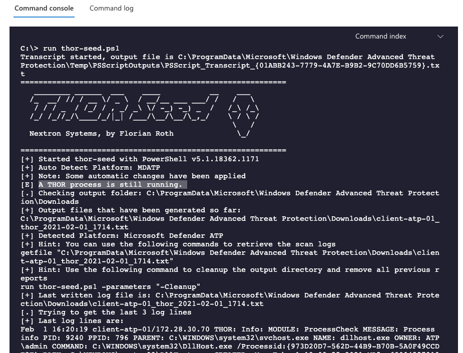
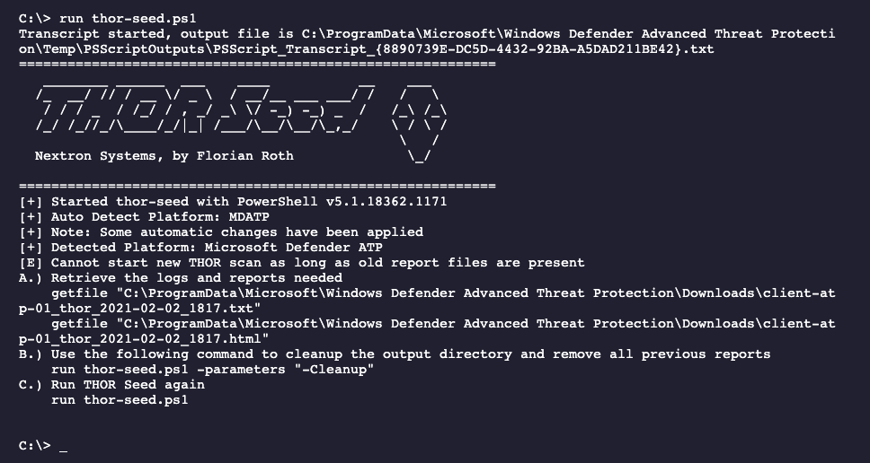

FAQs
====

THOR Seed
---------

Scan is terminating
^^^^^^^^^^^^^^^^^^^

Live response applies a rather disadvantages timeout for PowerShell
scripts run within a Live Response session, which is 30 minutes by
default. If a scan takes longer to complete, it gets terminated.

We recommend

-  using scan settings that allow the scan to terminate within 30
   minutes

-  increasing the timeout to a higher value in future versions of
   Microsoft Defender ATP

Since version 0.18 of THOR Seed, this situation gets handled
automatically. Just run thor-seed.ps1 another time to get information on
the thor64.exe process that still runs in the background. It will show
you information on the log file and print commands that you can use to
download the log file and HTML report once THOR finished its work.

If ``thor64.exe`` is still running when you start THOR seed, you will
get information regarding the current scan.

   THOR Seed after timeout

If ``thor64.exe`` is finished, you will get some example commands to
retrieve your files and clean up the reports of the previous scan.

   THOR Seed after finished scan

No Progress Indicator
^^^^^^^^^^^^^^^^^^^^^

The scripting environment doesn't give us the opportunity to report back
any status information before the script terminates. All output written
to STDOUT and STDERR will be returned at the end of the script execution
although it appears earlier.

Unfortunately, it is not possible to return information before the scan
terminates.

Old log files prevent new scan
^^^^^^^^^^^^^^^^^^^^^^^^^^^^^^

Simply run a cleanup before starting a new scan.

.. code-block:: doscon
   
   C:\> run thor-seed.ps1 -parameters "-Cleanup"

THOR alreay running error
^^^^^^^^^^^^^^^^^^^^^^^^^

It is possible that you've interrupted a previous script run with CTRL+C
and got back to the shell. In Live Response, sub processes started by
scripts running from the script library don't get killed on CTRL+C.

It is highly likely that a THOR scan is still running in the background
without you knowing.

Since version 0.18 of THOR Seed, this situation gets handled
automatically. Just run thor-seed.ps1 another time to get information on
the thor64.exe process that still runs in the background. It will show
you information on the log file and print commands that you can use to
download the log file and HTML report once THOR finished its work.

THOR Cloud
----------