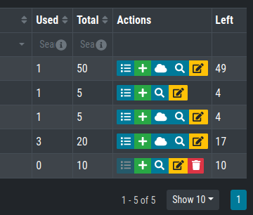
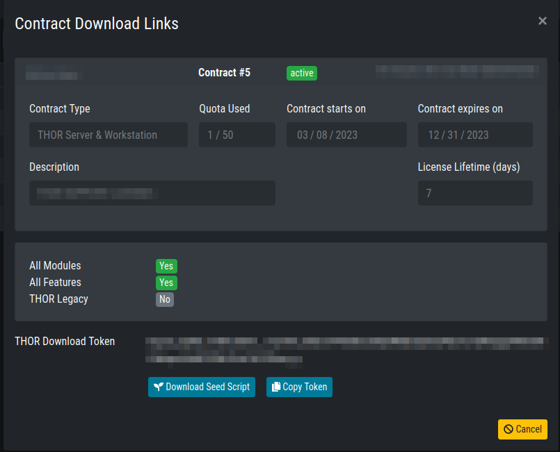

Retrieve and Configure THOR Seed
================================

Download THOR Seed using Voucher Trials
---------------------------------------

Trial users receive a link that leads to a web page, which lists the
attributes of the voucher rial including start date, expiration date,
the life time of each license and quota statistics.

You have to read and accept the EULA and check the box to enable the
download links.

.. figure:: ../images/image3.png
   :target: ../_images/image3.png
   :alt: THOR Cloud Voucher Trial

   THOR Cloud Voucher Trial

Download THOR Seed in Customer Portal
-------------------------------------

Every applicable contract in our customer portal shows a certain button
in the “Actions” column, which leads you to a THOR Seed download page.

   Button that leads to the THOR Seed download page

The THOR Seed download page lists all attributes of the contract
including the total quota, used licenses and the lifetime of each
license. (see the FAQ section at the end of this document for more
details on the terms)

   THOR Seed Download Page

Configure THOR Seed (Optional)
------------------------------

THOR Seed is the PowerShell script that retrieves THOR packages with a
valid license for the end system on which it was started, executes a
THOR scan and cleans up afterwards.

| You can find more information on Github:
| https://github.com/NextronSystems/nextron-helper-scripts/tree/master/thor-seed

The version that you’ve retrieved from our customer portal already
contains a token that is connected with you voucher trial or contract.
It is also configured to use our cloud systems to retrieve THOR
packages. (users of the ASGARD platform can also use an on-premise
ASGARD server to retrieve package from that local system)

Modify the Default Configuration
^^^^^^^^^^^^^^^^^^^^^^^^^^^^^^^^

In the section “PRESET CONFIGS” you can modify or choose different scan
options.

.. figure:: ../images/image6.png
   :target: ../_images/image6.png
   :alt: Configuration Presets

   Configuration Presets

THOR Seed already includes good presets that can just be “selected”
further below in the section.

.. figure:: ../images/image7.png
   :target: ../_images/image7.png
   :alt: Preset Selection

   Preset Selection

A list of all options can be found here:
https://github.com/NextronSystems/nextron-helper-scripts/tree/master/thor-help

The THOR manual contains a complete description of most of these
features and can downloaded from the “Downloads” section in the Nextron
customer portal.

Define False Positive Filters
^^^^^^^^^^^^^^^^^^^^^^^^^^^^^

THOR Seed also includes a section in which you could include false
positive statements (separated by new line) and defined as regular
expressions.

.. figure:: ../images/image8.png
   :target: ../_images/image8.png
   :alt: False Positive filters

   False Positive filters

It’s important to use escaping as it is used in regular expressions to
escape e.g., back slashes, periods, dollar and asterisk characters. The
expression is applied to a full log line. The THOR manual has more
information on these filters and a list of examples.
