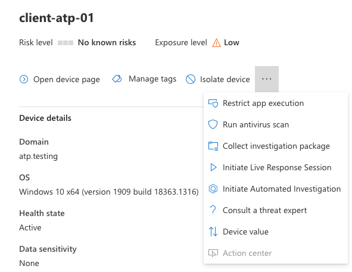
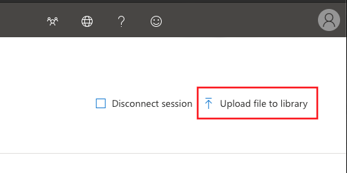
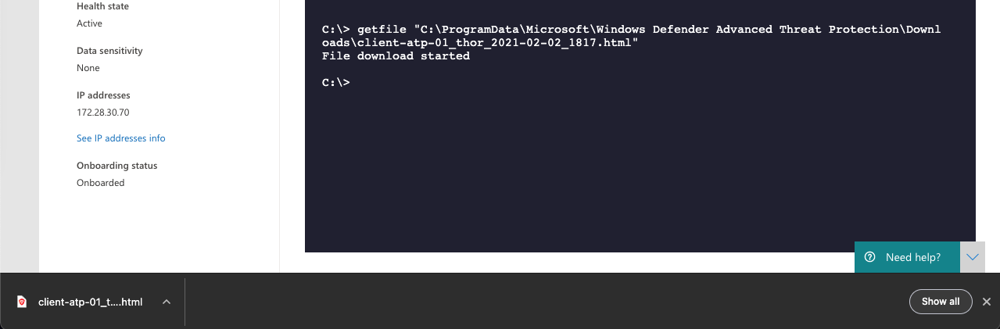

Start a THOR Scan
=================

Start a Live Response Session
-----------------------------

You find different locations in Microsoft Defender Security Center that
allow you to initiate a Live Response session.

   Initiate Live Response Session

Upload THOR Seed
----------------

Use the button in the upper right corner of the window to upload
“thor-seed.ps1” into the Live Response script library.

   Upload Button

Make sure to check “Overwrite file” to replace an older version of THOR
Seed in your library.

.. figure:: ../images/image11.png
   :target: ../_images/image11.png
   :alt: Upload THOR Seed

   Upload THOR Seed

Run THOR Seed
-------------

After uploading THOR Seed to the Live Response script library, you can
start the script with the “run” command.

.. figure:: ../images/image12.png
   :target: ../_images/image12.png
   :alt: Run thor-seed.ps1 in Live Response session

   Run thor-seed.ps1 in Live Response session

Interrupted THOR Seed Sessions
------------------------------

Microsoft Defender Security Center allows scripts a run time of a
maximum of 30 minutes and then terminates the script. However, the sub
process “thor64.exe” is still running.

.. figure:: ../images/image13.png
   :target: ../_images/image13.png
   :alt: Interrupted scan due to exceeded timeout
 
   Interrupted scan due to exceeded timeout

Check the Scan Status
^^^^^^^^^^^^^^^^^^^^^

In THOR Seed versions before v0.18, it was difficult to get the scan
status of THOR in the background or find the log files that THOR
produces during the scan and the HTML report that is generated at the
end of the scan.

Users can check of THOR is still running with

.. code:: bash

   processes -name thor64.exe

Since THOR Seed version 0.18 you just run thor-seed.ps1 again and will
see the information that THOR is still running, where to find the
current log file and the last 3 log lines of that file.

.. figure:: ../images/image14.png
   :target: ../_images/image14.png
   :alt: THOR Seed start while THOR is still running

   THOR Seed start while THOR is still running

You can run the script as often as you like to get an information on the
current status of the scan. A normal scan takes between 20 and 180
minutes to complete.

Detect a Finished Scan
^^^^^^^^^^^^^^^^^^^^^^

The moment that you run “thor-seed.ps1” while “thor64.exe” has finished
its job in the background, you get a listing of all generated log files
and HTML reports in the output directory and commands to download them
and remove them from the end system.

It shows a list of three actions to proceed:

1. | Retrieve the available log files and HTML reports
   | **get file "C:\\ProgramData\\Microsoft\\Windows Defender Advanced…**

2. | Use the following command to clean-up the output directory
   | **run thor-seed.ps1 -parameters "-Cleanup"**

3. | Start a new THOR scan with
   | **run thor-seed.ps1**

.. figure:: ../images/image15.png
   :target: ../_images/image15.png
   :alt: THOR Seed run shows previously finished scan

   THOR Seed run shows previously finished scan

Retrieve the Results
--------------------

The output of THOR Seed already contains the right commands to download
a report after the scan has finished.

.. figure:: ../images/image16.png
   :target: ../_images/image16.png
   :alt: THOR Seed output on a system with finished scan

   THOR Seed output on a system with finished scan

Simply copy and paste the full “getfile” command line to retrieve the
HTML report.

.. code:: bash
   
   getfile "C:\\ProgramData\\Microsoft\\Windows Defender Advanced Threat Protection\\Downloads\\client-atp-01\_thor\_2021-02-02\_1817.html"

   HTML Report Download in Browser

.. figure:: ../images/image18.png
   :target: ../_images/image18.png
   :alt: THOR HTML Report

   THOR HTML Report

Cleanup 
-------

In order to run another THOR scan, you have to remove all previous log
files and HTML reports using the following command:

.. code:: bash
   
   run thor-seed.ps1 -parameters "-Cleanup"

After removing the text logs and HTML reports you can start a new scan
on this end system.
