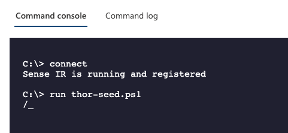

THOR Cloud
==========

This section focuses on our online platform ``THOR Cloud``.

THOR Cloud eliminates the need for on-premise systems for
licensing and scanner package downloads. With THOR Cloud,
all you need is a small yet powerful tool known as the THOR
Cloud launcher. Simply bring it to your endpoint or allow
end users to download and execute it themselves.

Download THOR Cloud Launcher Script
-----------------------------------

Once you logged into your THOR Cloud account, create a new Campaign
or use an existing one. In the Campaign details, download the Launcher
in the top right corner. You need to download the Script for your Operating
System, as the Live Response feature only allows the execution of scripts.

   Download the THOR Cloud Launcher Script

Start a Live Response Session
-----------------------------

You find different locations in Microsoft Defender Security Center that
allow you to initiate a Live Response session.

.. figure:: ../images/initiate-live-response-session.png
   :alt: Initiate Live Response Session

   Initiate Live Response Session

Upload THOR Cloud Launcher
--------------------------

Use the button in the upper right corner of the window to upload
the THOR Cloud Launcher script into the Live Response script library.

.. figure:: ../images/live-response-upload-script.png
   :alt: Upload Button

   Upload Button

Make sure to check "Overwrite file" to replace an older version of THOR
Seed in your library.

   Upload THOR Seed

Run THOR Cloud Launcher
-----------------------

After uploading THOR Seed to the Live Response script library, you can
start the script with the "run" command.

   Run thor-seed.ps1 in Live Response session