THOR Seed
=========

This section focuses on our powershell script ``thor-seed.ps1``.
THOR Seed is a script which can be configured to retrieve THOR
and a valid license from different sources, and execute a THOR scan.

If you want to use the "Live Response" feature of Microsoft Defender
for Endpoint on any other Operating System than Windows, you can use
THOR Cloud or additionally create your own scripts.

Download THOR Seed using Voucher Trials
---------------------------------------

Trial users receive a link that leads to a web page, which lists the
attributes of the voucher including start date, expiration date,
the life time of each license and quota statistics.

You have to read and accept the EULA and check the box to enable the
download links.

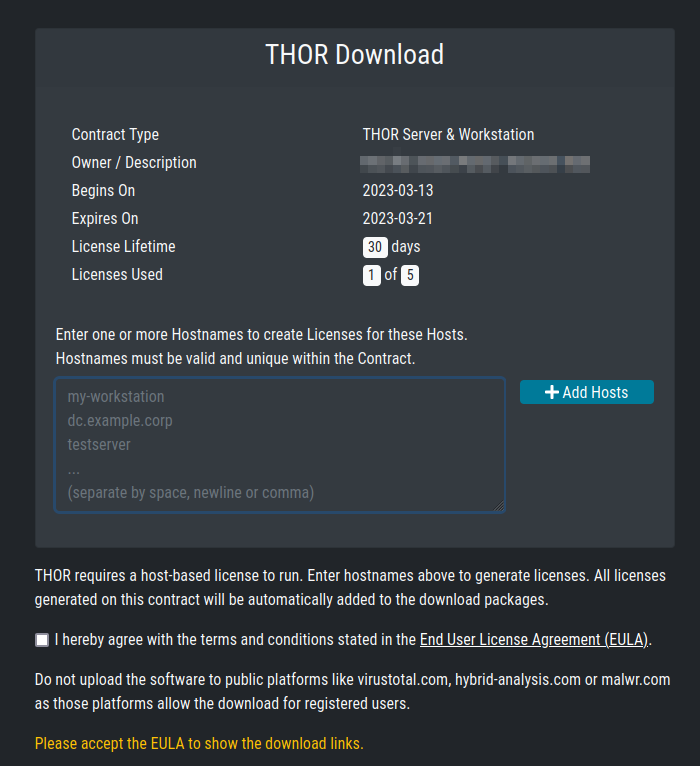

   THOR Cloud Voucher Trial

Download THOR Seed in Customer Portal
-------------------------------------

Every applicable contract in our customer portal shows a certain "Cloud" button
in the ``Actions`` column, which leads you to a THOR Seed download page.

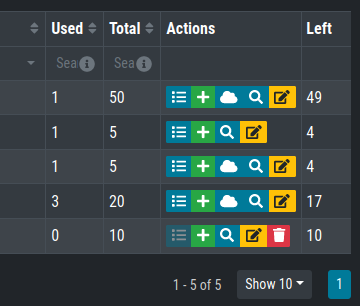

   Button that leads to the THOR Seed download page

The THOR Seed download page lists all attributes of the contract
including the total quota, used licenses and the lifetime of each
license. (see the FAQ section at the end of this document for more
details on the terms)

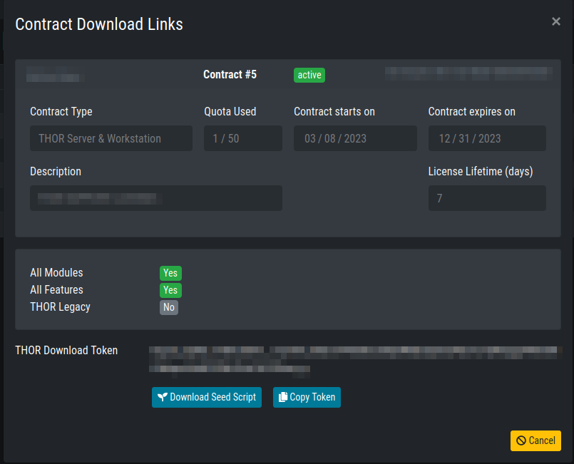

   THOR Seed Download Page

Configure THOR Seed (Optional)
------------------------------

THOR Seed is the PowerShell script that retrieves THOR packages with a
valid license for the end system on which it was started, executes a
THOR scan and cleans up afterwards.

| You can find more information on Github:
| https://github.com/NextronSystems/nextron-helper-scripts/tree/master/thor-seed

The version that you've retrieved from our customer portal already
contains a token that is connected with you voucher trial or contract.
It is also configured to use our cloud systems to retrieve THOR
packages. (users of the ASGARD platform can also use an on-premise
ASGARD server to retrieve package from that local system)

Modify the Default Configuration
^^^^^^^^^^^^^^^^^^^^^^^^^^^^^^^^

In the section “PRESET CONFIGS” you can modify or choose different scan
options.

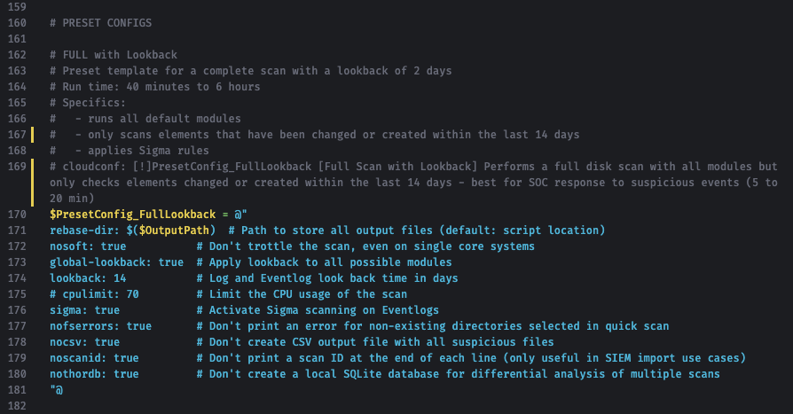

   Configuration Presets

THOR Seed already includes good presets that can just be "selected"
further below in the section.

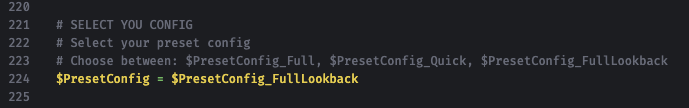

   Preset Selection

A list of all options can be found here:
https://github.com/NextronSystems/nextron-helper-scripts/tree/master/thor-help

The `THOR manual <https://thor-manual.nextron-systems.com/en/latest/>`_ contains a complete description of most of these
features and can downloaded from the “Downloads” section in the Nextron
customer portal.

Define False Positive Filters
^^^^^^^^^^^^^^^^^^^^^^^^^^^^^

THOR Seed also includes a section in which you could include false
positive statements (separated by new line) and defined as regular
expressions.

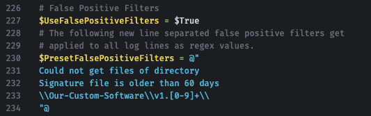

   False Positive filters

It's important to use escaping as it is used in regular expressions to
escape e.g., back slashes, periods, dollar and asterisk characters. The
expression is applied to a full log line. The `THOR manual <https://thor-manual.nextron-systems.com/en/latest/>`_ has more
information on these filters and a list of examples.

Start a Live Response Session
-----------------------------

You find different locations in Microsoft Defender Security Center that
allow you to initiate a Live Response session.

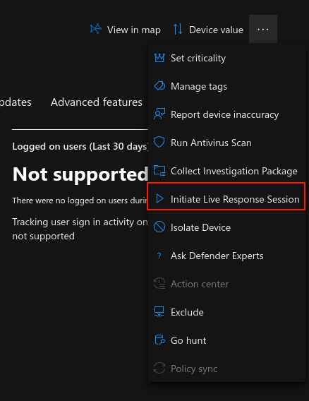

   Initiate Live Response Session

Upload THOR Seed
----------------

Use the button in the upper right corner of the window to upload
"thor-seed.ps1" into the Live Response script library.

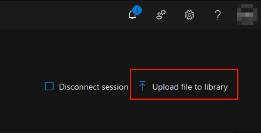

   Upload Button

Make sure to check "Overwrite file" to replace an older version of THOR
Seed in your library.

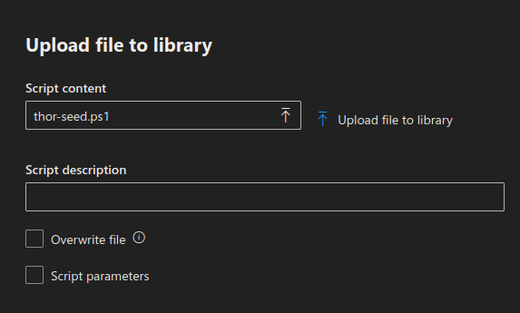

   Upload THOR Seed

Run THOR Seed
-------------

After uploading THOR Seed to the Live Response script library, you can
start the script with the "run" command.

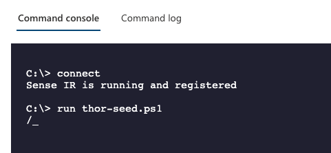

   Run thor-seed.ps1 in Live Response session

Interrupted THOR Seed Sessions
------------------------------

Microsoft Defender Security Center allows scripts a run time of a
maximum of 30 minutes and then terminates the script. However, the sub
process "thor64.exe" is still running.

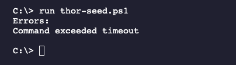
 
   Interrupted scan due to exceeded timeout

Check the Scan Status
^^^^^^^^^^^^^^^^^^^^^

In THOR Seed versions before v0.18, it was difficult to get the scan
status of THOR in the background or find the log files that THOR
produces during the scan and the HTML report that is generated at the
end of the scan.

Users can check of THOR is still running with

.. code-block:: doscon

   C:\> processes -name thor64.exe

Since THOR Seed version 0.18 you just run thor-seed.ps1 again and will
see the information that THOR is still running, where to find the
current log file and the last 3 log lines of that file.

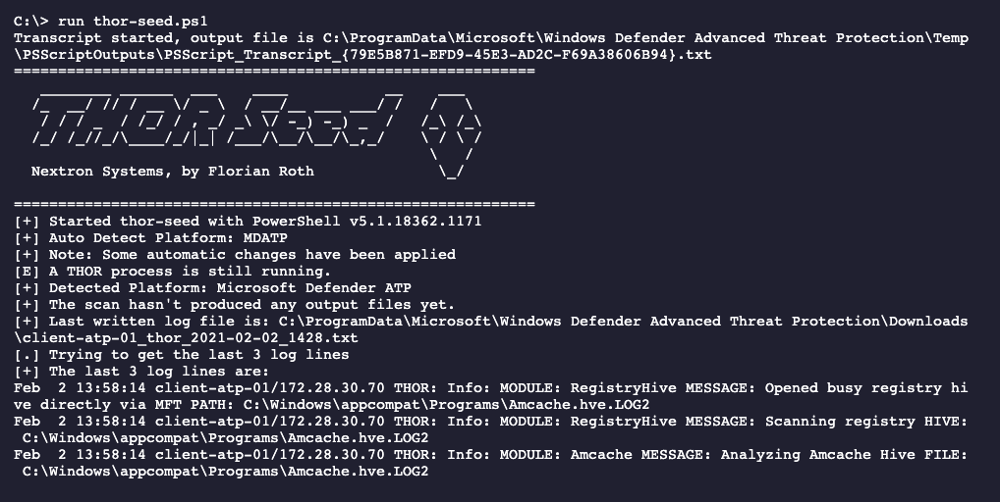

   THOR Seed start while THOR is still running

You can run the script as often as you like to get an information on the
current status of the scan. A normal scan takes between 20 and 180
minutes to complete.

Detect a Finished Scan
^^^^^^^^^^^^^^^^^^^^^^

The moment that you run “thor-seed.ps1” while “thor64.exe” has finished
its job in the background, you get a listing of all generated log files
and HTML reports in the output directory and commands to download them
and remove them from the end system.

It shows a list of three actions to proceed:

1. Retrieve the available log files and HTML reports
   
   .. code-block:: doscon
      
      C:\> get file "C:\ProgramData\Microsoft\Windows Defender Advanced…

2. Use the following command to clean-up the output directory
   
   .. code-block:: doscon
   
      C:\> run thor-seed.ps1 -parameters "-Cleanup"

3. Start a new THOR scan with
   
   .. code-block:: doscon
   
      C:\> run thor-seed.ps1

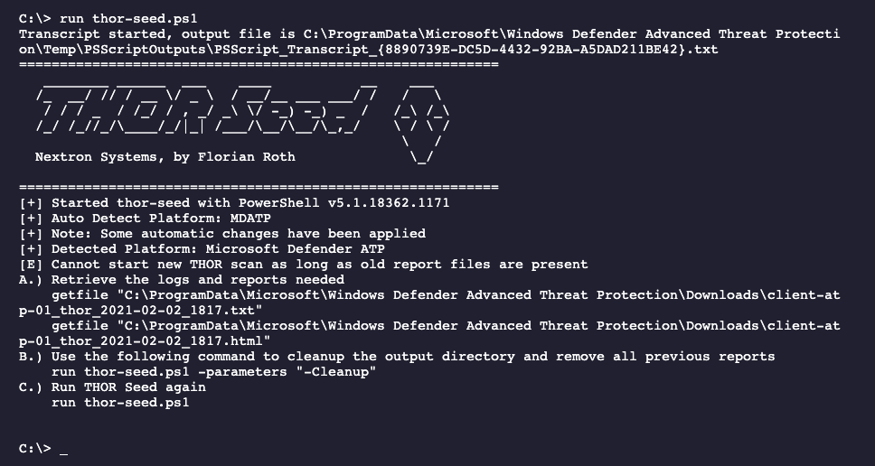

   THOR Seed run shows previously finished scan

Retrieve the Results
--------------------

The output of THOR Seed already contains the right commands to download
a report after the scan has finished.

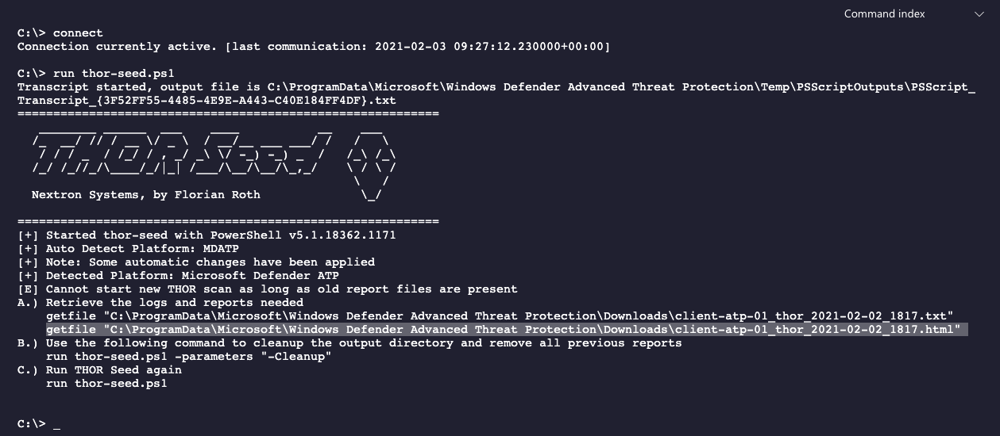

   THOR Seed output on a system with finished scan

Simply copy and paste the full "getfile" command line to retrieve the
HTML report.

.. code-block:: doscon
   
   C:\> getfile "C:\ProgramData\Microsoft\Windows Defender Advanced Threat Protection\Downloads\client-atp-01_thor_2021-02-02_1817.html"

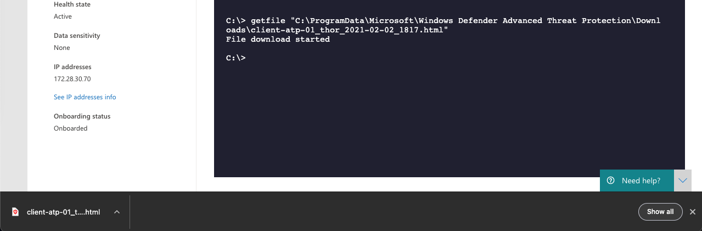

   HTML Report Download in Browser

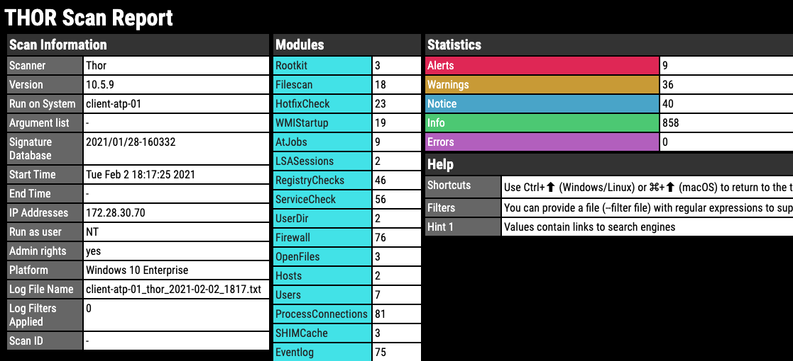

   THOR HTML Report

Cleanup 
-------

In order to run another THOR scan, you have to remove all previous log
files and HTML reports using the following command:

.. code-block:: doscon
   
   C:\> run thor-seed.ps1 -parameters "-Cleanup"

After removing the text logs and HTML reports you can start a new scan
on this end system.